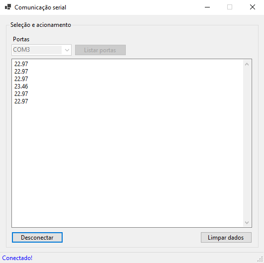

  

# C# - Software para ler dados da porta serial

## O que é este projeto?
O projeto tem como objetivo a leitura de dados da porta serial (porta COM). Pode ser usado para testar a leitura de sensores com a placa arduino ou qualquer outro caso que utilize a escrita na porta analógica serial.

## Pré-requisitos
- Visual Studio
- .NET 6

## Para rodar este projeto

Apenas abrir o vusual studio e carregar o arquivo do projeto e compila-lo.
